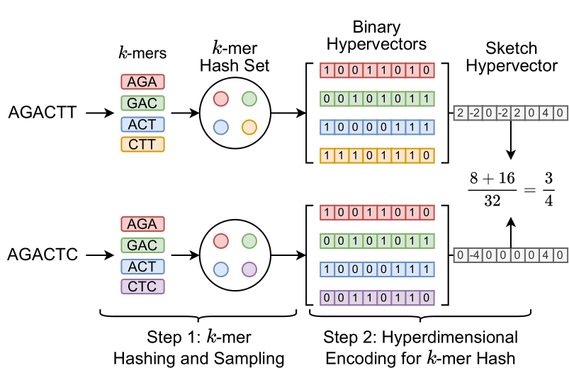
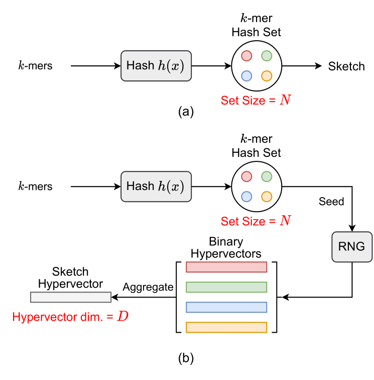

[](https://github.com/wh-xu/Hyper-Gen/blob/main/LICENSE)

## HyperGen: Compact and Efficient Genome Sketching using Hyperdimensional Vectors

_HyperGen_ is a Rust library used to sketch genomic files and realize fast Average Nucleotide Identity (ANI) approximation. _HyperGen_ leverages two advanced algorithms: 1. FracMinHash and 2. hyperdimensional computing (HDC) with random indexing as shown in the following figure:
<p align="center">
    
</p>

_HyperGen_ first samples the kmer set using FracMinHash. Then the kmer hashes are encoded into hyperdimensional vectors (HVs) using HDC encoding to obtain better tradeoff of ANI estimation quality, sketch size, and computation speed. The sketch size generated by _HyperGen_ is 1.8 to 2.7× smaller than _Mash_ and _Dashing 2_. ANI estimation in _HyperGen_ can be realized using highly vectorized vector multiplication. _HyperGen_'s database search speed for large-scale datasets is up to 4.3x faster than _Dashing 2_.

## Quickstart

### Installation

_HyperGen_ requires [`Rust`](https://www.rust-lang.org/tools/install) language and [`Cargo`](https://doc.rust-lang.org/cargo/) to be installed. 
We recommend installing _HyperGen_ using the following command:
```sh
git clone https://github.com/wh-xu/Hyper-Gen.git
cd Hyper-Gen

cargo install --path .
```

### Usage
Current version supports following functions:

#### 1. Genome sketching for .fa/.fna/.fasta files
```sh
Example:
hyper-gen-rust sketch -p ./data -o ./fna.sketch

Positional arguments:
-p, --path <PATH>               Input folder path to sketch
-o, --out <OUT>                 Output path 
-t, --thread <THREAD>           Threads used for computation [default: 16]
-C, --canonical <CANONICAL>     If use canonical kmer [default: true]
-k, --ksize <KSIZE>             k-mer size for sketching [default: 21]
-S, --seed <SEED>               Hash seed [default: 123]
-s, --scaled <SCALED>           Scaled factor for FracMinHash [default: 1500]
-d, --hv_d <HD_D>               Dimension for hypervector [default: 4096]
-D, --device <DEVICE>           Device to run [default: cpu] [possible values: cpu, gpu]
```


#### 2. ANI estimation and database search
```sh
Example:
hyper-gen-rust dist -r fna1.sketch -q fna2.sketch -o output.ani

Positional arguments:
-r, --path_r <PATH_R>           Path to ref sketch file
-q, --path_q <PATH_Q>           Path to query sketch file
-o, --out <OUT>                 Output path 
-t, --thread <THREAD>           Threads used for computation [default: 16]
-a, --ani_th <ANI_TH>           ANI threshold [default: 85.0]
```


## Differences between _Mash_ and _HyperGen_

<p align="center">
    
</p>

- (a) _Mash_ uses MinHash to sample kmer hash set and stores discrete hash values as the genome sketch.
- (b) _HyperGen_ uses FracMinHash to sample kmer hash set and encodes discrete hash values into continuous _sketch hypervector_.


## Publication
1. Weihong Xu, Po-kai Hsu, Niema Moshiri, Shimeng Yu, and Tajana Rosing. "[HyperGen: Compact and Efficient Genome Sketching using Hyperdimensional Vectors](https://www.biorxiv.org/content/10.1101/2024.03.05.583605)." _Under review_.


## Contact
For more information, post an issue or send an email to <wexu@ucsd.edu>.
